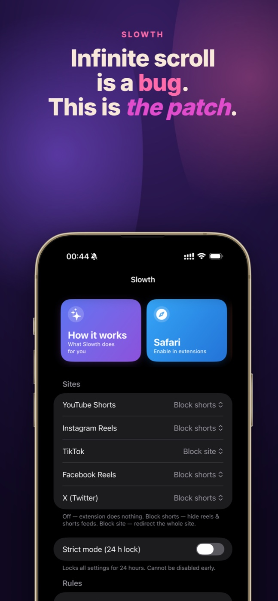
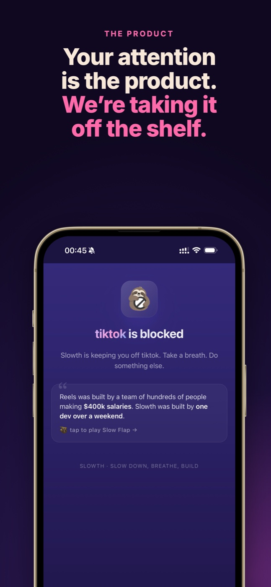
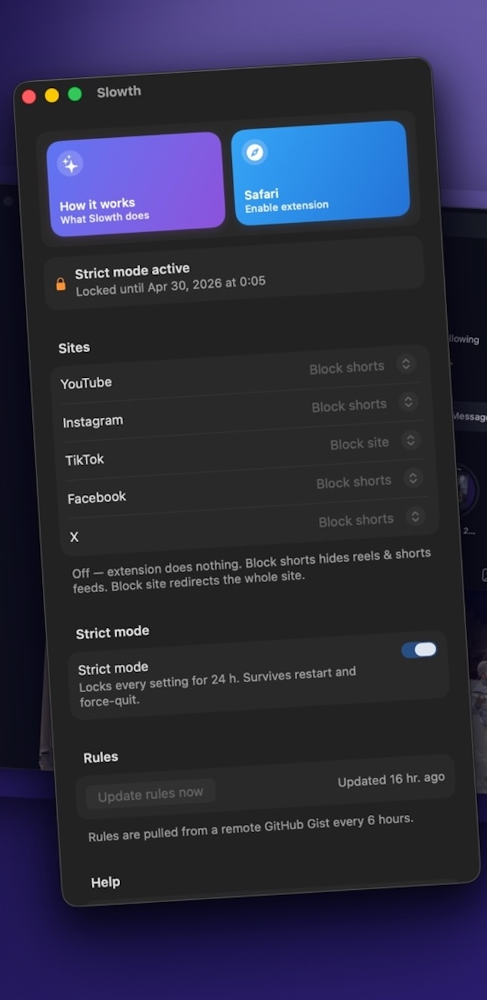

<div align="center">


# Slowth

**Infinite scroll is a bug. This is the patch.**

Hide YouTube Shorts, Instagram &amp; Facebook Reels, and block TikTok — right
in Safari. Free. No accounts. No tracking.

[](https://apps.apple.com/us/app/slowth-block-reels/id6764140763)
[](https://malina.page/slowth/)
[](LICENSE)


</div>

Slowth removes the infinite-feed traps while leaving the rest of each site
usable. You don't have to delete anything; you just lose the black hole.

## Screenshots

<p align="center">
  
  
  
</p>

## What it does

- Hides Shorts / Reels on **YouTube, Instagram, Facebook, X** and blocks
  **TikTok** entirely.
- **Per-site control** — for each site, pick one of three states.
- **Strict mode** — a 24-hour lock. Once on, you can't loosen your own
  settings until it expires. Survives app restart and reboot; the only
  bypass is uninstall + reinstall.
- **Family Controls (iOS)** — optionally block the native apps too, not just
  the web.
- **Remote blocking rules** — CSS selectors and redirects load from a remote
  config and are cached on-device, so breakage from a site redesign gets
  fixed without shipping an app update.

### Sites and modes

| Site      | Modes                        | Default |
|-----------|------------------------------|---------|
| YouTube   | off / shorts only / block    | shorts  |
| Instagram | off / shorts only / block    | shorts  |
| Facebook  | off / shorts only / block    | shorts  |
| X         | off / shorts only / block    | shorts  |
| TikTok    | off / block                  | block   |

- **off** — do nothing.
- **shorts only** — hide the short-video surfaces and redirect their URLs.
- **block** — redirect the whole site to a local blocked page.

## How it works

Two UI surfaces on top of one shared store:

- **Host apps (iOS + macOS)** — a single SwiftUI codebase drives the
  settings directly. No web view, no JS bridge.
- **Safari Web Extension popup** — talks to the extension's native handler
  over native messaging.

The source of truth is **App Group `UserDefaults`**, shared across all four
targets (macOS app, iOS app, and both Safari extension targets). The
extension's background script uses `webNavigation` as a tri-state
dispatcher: *off* → no-op, *shorts* → inject hide-CSS + URL redirects,
*block* → redirect the tab to a local blocked page. Blocking rules are
versioned, fetched with an ETag and a throttle, and refreshed on a 6h alarm.

## Build

Requires Xcode 26+ and [XcodeGen](https://github.com/yonaskolb/XcodeGen)
(`brew install xcodegen`).

```sh
# 1. Set your signing info
cp Configs/Local.xcconfig.example Configs/Local.xcconfig
#    then edit DEVELOPMENT_TEAM and BUNDLE_ID_PREFIX

# 2. Generate the Xcode project
xcodegen generate
open Unscroll.xcodeproj
```

CLI builds:

```sh
xcodebuild -project Unscroll.xcodeproj -scheme 'Unscroll' \
  -configuration Debug -destination 'platform=macOS' build

xcodebuild -project Unscroll.xcodeproj -scheme 'Unscroll (iOS)' \
  -configuration Debug -destination 'generic/platform=iOS Simulator' build
```

## Layout

```
Shared/        SwiftUI host-app UI + App Group store (shared across targets)
App/           macOS host app (Info.plist, entitlements, icon)
iOS/           iOS host app + Family Controls integration
Extension/     macOS Safari Web Extension native handler
ExtensionIOS/  iOS Safari Web Extension native handler
WebExt/        Extension resources — manifest, popup, content scripts, rules
project.yml    XcodeGen spec — single source of truth for the project
```

## Privacy

Slowth stores your settings on-device in an App Group container and fetches
public blocking rules over HTTPS. It has no backend, no analytics, and never
sends your browsing anywhere. On iOS, the list of apps you choose to block is
held by the OS in a privacy-protected token that the app itself cannot read.

## License

[GNU General Public License v3.0](LICENSE). You may use, study, share, and
modify this code, but any distributed derivative must also be released under
GPLv3 with source available.
