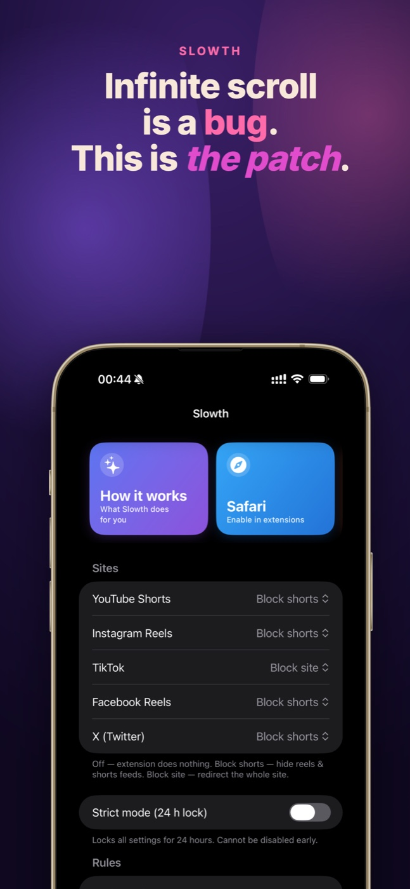
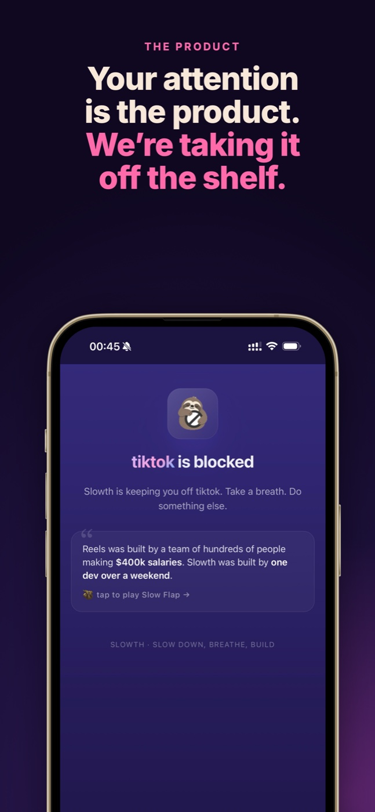
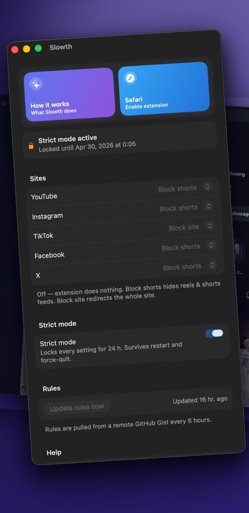

<div align="center">


# Slowth

**Infinite scroll is a bug. This is the patch.**

Block YouTube Shorts, Instagram &amp; Facebook Reels, X Explore and trends, and
TikTok in Safari. On iOS, optional Real-time Blocking (Beta) also covers
Shorts, Reels, and Stories inside the YouTube and Instagram apps. Free. No
accounts. No tracking.

[](https://apps.apple.com/us/app/slowth-block-reels/id6764140763)
[](https://malina.page/slowth/)
[](LICENSE)


</div>

Slowth removes targeted infinite-feed traps while leaving other sections
usable, or blocks a whole site when you choose. You don't have to delete
anything; you just lose the black hole.

## Screenshots

<p align="center">
  
  
  
</p>

## What it does

- Blocks **YouTube Shorts**, **Instagram and Facebook Reels**, and **X Explore
  and trends**, while blocking **TikTok** entirely by default.
- **Per-site control** — each site offers the modes supported by its actual
  blocking behavior, with up to four choices.
- **Strict mode** — a 24-hour lock. Once on, you can't loosen your own
  settings until it expires. Survives app restart and reboot; the only
  bypass is uninstall + reinstall.
- **Real-time app blocking (iOS Beta)** — use Family Controls and an on-device
  screen-recording classifier to block selected content in the native YouTube
  and Instagram apps.
- **Remote blocking rules** — CSS selectors and redirects load from a remote
  config and are cached on-device, allowing site fixes without an app update.
  Strict mode pauses rule changes until its lock expires.

### Sites and modes

| Site      | Modes                                                   | Default              |
|-----------|---------------------------------------------------------|----------------------|
| YouTube   | off / block Shorts / block site                         | block Shorts         |
| Instagram | off / block Reels / block Reels + feeds / block site    | block Reels + feeds  |
| Facebook  | off / block Reels / block Reels + feed / block site     | block Reels + feed   |
| X         | off / block Explore &amp; trends / block site            | block Explore &amp; trends |
| TikTok    | off / block site                                        | block site           |

- **off** — do nothing.
- **site-specific block** — block Shorts on YouTube, Reels on Instagram and
  Facebook, or Explore and trends on X.
- **site-specific block + feed** — on Instagram and Facebook, also stop the
  endless home feed after a few screens. Instagram additionally covers
  Explore, Stories, and more Reels surfaces.
- **block site** — redirect the whole site to a local blocked page.

## How it works

Two UI surfaces on top of one shared store:

- **Host apps (iOS + macOS)** — a single SwiftUI codebase drives the
  settings directly. No web view, no JS bridge.
- **Safari Web Extension popup** — talks to the extension's native handler
  over native messaging.

The source of truth is **App Group `UserDefaults`**, shared by the host apps,
both Safari extensions, and the iOS real-time blocking helper extensions. The
Safari extension uses four internal mode values: *off* → no-op, *shorts* →
site-specific hide-CSS and URL redirects, *feed* → the same blocking plus
Instagram/Facebook feed limits, and *all* → redirect the tab to a local
blocked page. Blocking rules are versioned, fetched with an ETag and a
throttle, and checked on a 6h alarm; Strict mode prevents downloaded changes
from being saved until the lock expires.

## Build

Requires Xcode 26+ and [XcodeGen](https://github.com/yonaskolb/XcodeGen)
(`brew install xcodegen`).

```sh
# 1. Set your signing info
cp Configs/Local.xcconfig.example Configs/Local.xcconfig
#    then edit DEVELOPMENT_TEAM and BUNDLE_ID_PREFIX

# 2. Generate the Xcode project
xcodegen generate
open Unscroll.xcodeproj
```

CLI builds:

```sh
xcodebuild -project Unscroll.xcodeproj -scheme 'Unscroll' \
  -configuration Debug -destination 'platform=macOS' build

xcodebuild -project Unscroll.xcodeproj -scheme 'Unscroll (iOS)' \
  -configuration Debug -destination 'generic/platform=iOS Simulator' build
```

### Realtime Shield models

Private training images use the session-aware schema documented in
[`docs/realtime-dataset.md`](docs/realtime-dataset.md). Validate the canonical
inventory before training:

```sh
uv sync
uv run python scripts/realtime_dataset.py validate sandbox/dataset/manifest.csv
```

`SurfaceDetector` is the only real-time classifier and uses only the canonical dataset. Training
requires every class in both train and validation; final evaluation requires
every class in test:

```sh
uv run python scripts/surface_ml.py train \
  sandbox/dataset/manifest.csv sandbox/surface-detector.pt
uv run python scripts/surface_ml.py evaluate \
  sandbox/dataset/manifest.csv sandbox/surface-detector.pt --split validation
uv run python scripts/surface_ml.py evaluate \
  sandbox/dataset/manifest.csv sandbox/surface-detector.pt --split test
uv run python scripts/surface_ml.py export \
  sandbox/surface-detector.pt sandbox/SurfaceDetector.mlpackage \
  sandbox/SurfaceDetectorMetadata.json
uv run python scripts/surface_ml.py verify-export \
  sandbox/dataset/manifest.csv sandbox/surface-detector.pt \
  sandbox/SurfaceDetector.mlpackage --split validation
uv run python scripts/surface_ml.py verify-export \
  sandbox/dataset/manifest.csv sandbox/surface-detector.pt \
  sandbox/SurfaceDetector.mlpackage --split test
```

The network has an app head (`youtube`, `instagram`, `other`) and conditional
content heads (`shorts`/`normal` for YouTube and `reels`/`stories`/`normal`
for Instagram). Blocking uses `P(app) × P(content | app)`. Shorts, Reels, and Stories
thresholds are calibrated independently on validation sessions, with three
positive votes in the latest five inference frames required for a detection
event. Test is not used for training or calibration.

After a candidate passes validation, test, and Core ML parity, copy
`SurfaceDetector.mlpackage` and `SurfaceDetectorMetadata.json` into
`RealtimeShield/` and regenerate the Xcode project. Until both resources are
present, enabled real-time surfaces fail closed. Instagram enforcement remains
off until the user chooses Instagram and enables Reels and/or Stories.

The currently bundled FP32 model is
`surface-hierarchical-v10-expanded-dataset`. Its release policy keeps each
validation-calibrated threshold at least as conservative as the corresponding
production-proven V9 threshold. V10 passes validation, the full regression
test, Core ML parity, and direct Core ML checks on 710 critical train frames;
the previous Apple Stocks Stories false block is gone. See
`REALTIME_SHIELD_HANDOFF.md` for the full promotion record and the test-integrity
note for the post-fix regression run. A code-signature-verified App Store
Connect IPA for version 0.8.1 build 1 is ready; it has not been uploaded.

Each recording is one `session_id`; never place frames from the same session
in different splits. New canonical imports stay `unassigned` until their
session boundaries are reviewed. Checkpoint selection and threshold
calibration use validation sessions only. The runtime blocks after three
positive votes in the latest five inference frames and fails closed if the
model cannot load or run.
`sandbox/` is intentionally ignored because it contains private captures and
local training artifacts.

#### Device logs on macOS

The Broadcast Extension writes lifecycle events, errors, detections, and a
structured metrics snapshot every 10 seconds to Apple Unified Logging under
the `com.slowth.realtimeshield` subsystem. Connect and trust the iPhone, run a
test session, then collect the last 30 minutes on the Mac:

```sh
scripts/collect_realtime_shield_logs.sh 30m
```

Pass the device UDID as the second argument when more than one device is
connected. macOS asks for an administrator password because Apple restricts
physical-device log collection to root. The command stores a `.logarchive` plus `events.ndjson`,
machine-readable and text error/metrics files, and `summary.txt` under
`sandbox/realtime-shield-logs/`. The archive opens in Console.app. For a live
view, select the connected iPhone in Console.app and filter by subsystem
`com.slowth.realtimeshield`.

## Layout

```
Shared/        SwiftUI host-app UI + App Group store (shared across targets)
App/           macOS host app (Info.plist, entitlements, icon)
iOS/           iOS host app + Family Controls integration
RealtimeShield/ ReplayKit detector, bundled Core ML model, and diagnostics
Extension/     macOS Safari Web Extension native handler
ExtensionIOS/  iOS Safari Web Extension native handler
WebExt/        Extension resources — manifest, popup, content scripts, rules
scripts/       Session-aware dataset, training, evaluation, and export tools
project.yml    XcodeGen spec — single source of truth for the project
```

## Privacy

Slowth stores your settings on-device in an App Group container and fetches
public blocking rules over HTTPS. It has no backend, no analytics, and never
sends your browsing anywhere. On iOS, the list of apps you choose to block is
held by the OS in a privacy-protected token that the app itself cannot read.

## License

[GNU General Public License v3.0](LICENSE). You may use, study, share, and
modify this code, but any distributed derivative must also be released under
GPLv3 with source available.

The bundled `SurfaceDetector` Core ML package, its trained weights, and its
metadata are also licensed under GPLv3; see the
[model license notice](RealtimeShield/MODEL_LICENSE.md). Private training
captures and datasets are not distributed and are not covered by that notice.
