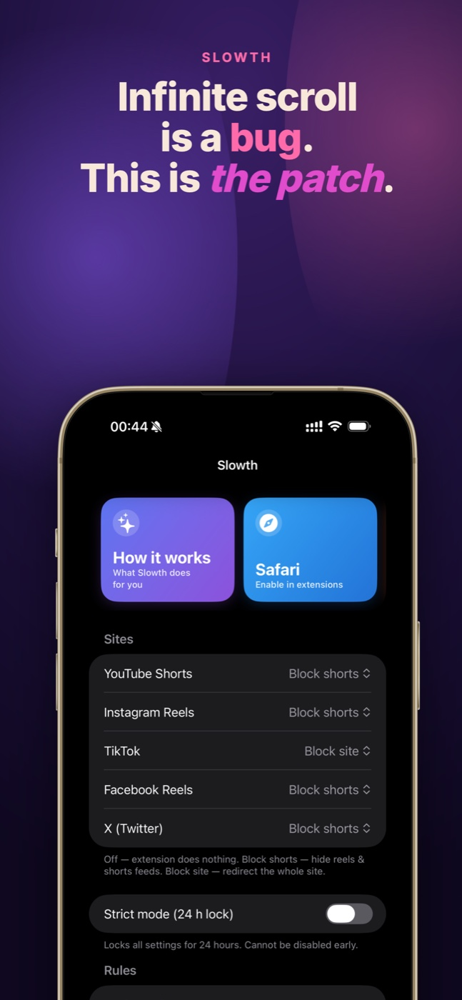
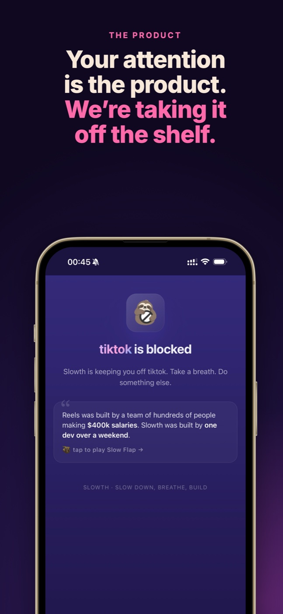
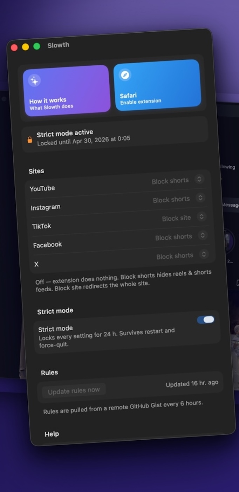

<div align="center">


# Slowth

**Infinite scroll is a bug. This is the patch.**

Block YouTube Shorts, Instagram &amp; Facebook Reels, X Explore and trends, and
TikTok in Safari. On iOS, optional Real-time Blocking also covers
Shorts, Reels, and Stories inside the YouTube and Instagram apps. Free. No
accounts. No tracking.

[](https://apps.apple.com/us/app/slowth-block-reels/id6764140763)
[](https://malina.page/slowth/)
[](LICENSE)


</div>

Slowth removes targeted infinite-feed traps while leaving other sections
usable, or blocks a whole site when you choose. You don't have to delete
anything; you just lose the black hole.

## Screenshots

<p align="center">
  
  
  
</p>

## What it does

- Blocks **YouTube Shorts**, **Instagram and Facebook Reels**, and **X Explore
  and trends**, while blocking **TikTok** entirely by default.
- **Per-site control** — each site offers the modes supported by its actual
  blocking behavior, with up to four choices.
- **Strict mode** — a 24-hour lock. Once on, you can't loosen your own
  settings until it expires. Survives app restart and reboot; the only
  bypass is uninstall + reinstall.
- **Real-time app blocking (iOS)** — use Family Controls and an on-device
  screen-recording classifier to block selected content in the native YouTube
  and Instagram apps.
- **Remote blocking rules** — CSS selectors and redirects load from a remote
  config and are cached on-device, allowing site fixes without an app update.
  Strict mode pauses rule changes until its lock expires.

### Safari blocking switches

| Site | Independent content switches |
|------|------------------------------|
| YouTube | Shorts |
| Instagram | Reels; Infinite Feed (home feed, Explore, Stories and continuous reel scrolling) |
| Facebook | Reels; Infinite Feed (home feed) |
| X | Explore and trends together |
| TikTok | Whole-site blocking only |

Every site also has a **Block site** switch. Content switches default to on;
whole-site blocking defaults to off except for TikTok. Blocking a whole site
disables its content controls without clearing their values. Existing users'
mode/boolean settings migrate once with their effective restrictions intact,
even during Strict mode.

Infinite Feed retains the existing scrolling limits and Stories reminder;
it does not implicitly enable the separate Reels hiding/redirect switch.

## How it works

Two UI surfaces on top of one shared store:

- **Host apps (iOS + macOS)** — a single SwiftUI codebase drives the
  settings directly. No web view, no JS bridge.
- **Safari Web Extension popup** — talks to the extension's native handler
  over native messaging.

The source of truth is **App Group `UserDefaults`**, shared by the host apps,
both Safari extensions, and the iOS real-time blocking helper extensions. The
Safari extension uses independent `shorts`, `feed`, and `all` boolean flags
per site, stored under `siteBlockingV2`. Here `shorts` means the site's targeted
content (Shorts, Reels, or Explore and trends), `feed` enables scrolling limits,
and `all` redirects the whole site to a local blocked page. The native handler
accepts per-feature writes so changing one switch preserves the others.
Open visible tabs refresh at the existing 30-second cache interval and when
focused; popup changes are broadcast immediately. Blocking rules are versioned, fetched with an ETag and a
throttle, and checked on a 6h alarm; Strict mode prevents downloaded changes
from being saved until the lock expires.

### macOS app language

Choose **Help → Language** at the bottom of the macOS app to switch its interface
immediately. All 46 bundled translations are available, named in their own
languages. The choice survives relaunch; **System default** follows macOS's
per-app language preference. This setting does not change Safari's popup language
or the iOS app language.

### App Store reviews

The host app makes at most one automatic StoreKit review request per local
installation: after seven full days, openings on three distinct dates, and an
enabled blocking setting. It waits for an active main screen with no app dialogs
or pending authorization. The attempt is saved before calling StoreKit, even if
Apple does not display the prompt; app updates and interface changes do not reset
it. Debug, Simulator and TestFlight builds do not consume the attempt. Direct
download macOS builds do not request reviews automatically. “Rate Slowth” in Help
always opens the App Store review page. These preferences are local and may reset
after reinstalling the app.

In Debug builds, unlock Debug with 15 taps on the version and find **App Store
review**. **Show system review prompt now** calls StoreKit directly without
checking dates or blocking settings and without changing the attempt flag.
The iOS debug path uses `AppStore.requestReview(in:)` with the unique active key
window scene and refuses the call without one. The panel shows the OS/build,
receipt filename and request API. This diagnostic path does not change the
automatic production request. Beta iOS can suppress review prompts even in a
development run; see the [Apple Developer Forums report](https://developer.apple.com/forums/thread/821981).
**Prepare review test (7 days / 3 dates)** seeds eligible local history;
**Test one-time review request** uses the real eligibility check and saves the
attempt before calling StoreKit and reports the specific reason if ineligible.
A second test must make no request. **Reset
review history** clears only the review dates and attempt flag. The panel also
shows dates, blocking/readiness conditions and the saved flag. These explicit
test actions are compiled out of Release and TestFlight.

## Build

Requires Xcode 26+ and [XcodeGen](https://github.com/yonaskolb/XcodeGen)
(`brew install xcodegen`).

```sh
# 1. Set your signing info
cp Configs/Local.xcconfig.example Configs/Local.xcconfig
#    then edit DEVELOPMENT_TEAM and BUNDLE_ID_PREFIX

# 2. Generate the Xcode project
xcodegen generate
open Unscroll.xcodeproj
```

CLI builds:

Xcode schemes: `Debug - macOS`, `Release - macOS`, `Debug - iOS`, and
`Relise - iOS` (Release configuration). The macOS Release scheme uses Release for
every action, including Run and Archive, and excludes the debug interface.
The Debug schemes use the local StoreKit configuration for purchase testing;
the Release schemes use the real StoreKit environment.

```sh
xcodebuild -project Unscroll.xcodeproj -scheme 'Debug - macOS' \
  -configuration Debug -destination 'platform=macOS' build

xcodebuild -project Unscroll.xcodeproj -scheme 'Release - macOS' \
  -configuration Release -destination 'platform=macOS' build

xcodebuild -project Unscroll.xcodeproj -scheme 'Debug - iOS' \
  -configuration Debug -destination 'generic/platform=iOS Simulator' build
```

### Realtime Shield models

For public Release archives, signed GitHub releases, and rebuilding with the
separate production model asset, see [the release workflow](docs/BUILD_TRUST.md).
Run `python3 scripts/release.py check` to validate the public snapshot without publishing.

ML tooling, dependency files, tests, and private data live in
[`data-model/`](data-model/README.md). Production Swift/Core ML resources remain
in `RealtimeShield/`; generate and build Xcode from the repository root.
The relocation does not retrain or promote a model.

Private images use the [session-aware schema](data-model/docs/realtime-dataset.md).
Run ML commands from `data-model`, reusing the root Python environment:

```sh
cd data-model
export UV_PROJECT_ENVIRONMENT="$(cd .. && pwd)/.venv"
uv sync --locked
uv run --locked python -m tools.realtime_dataset validate dataset/manifest.csv
# Local annotation UI: http://127.0.0.1:8765
uv run --locked python -m tools.screenshot_labeler
```

Cascade V10 (expanded candidate pool) is the current iOS default, with experimental qualification.
For a new cascade, follow the [complete training-to-app pipeline](data-model/docs/cascade-model-pipeline.md).
The following `SurfaceDetector` commands are for legacy single-model experiments. Training
requires every class in both train and validation; final evaluation requires
every class in test:

```sh
uv run --locked python -m tools.surface_ml train \
  dataset/manifest.csv epochs/checkpoints/surface-detector.pt
uv run --locked python -m tools.surface_ml evaluate \
  dataset/manifest.csv epochs/checkpoints/surface-detector.pt --split validation
uv run --locked python -m tools.surface_ml evaluate \
  dataset/manifest.csv epochs/checkpoints/surface-detector.pt --split test
mkdir -p exports/surface-candidate
uv run --locked python -m tools.surface_ml export \
  epochs/checkpoints/surface-detector.pt exports/surface-candidate/SurfaceDetector.mlpackage \
  exports/surface-candidate/SurfaceDetectorMetadata.json
uv run --locked python -m tools.surface_ml verify-export \
  dataset/manifest.csv epochs/checkpoints/surface-detector.pt \
  exports/surface-candidate/SurfaceDetector.mlpackage --split validation
uv run --locked python -m tools.surface_ml verify-export \
  dataset/manifest.csv epochs/checkpoints/surface-detector.pt \
  exports/surface-candidate/SurfaceDetector.mlpackage --split test
```

The network has an app head (`youtube`, `instagram`, `other`) and conditional
content heads (`shorts`/`normal` for YouTube and `reels`/`stories`/`normal`
for Instagram). Blocking uses `P(app) × P(content | app)`. Shorts, Reels, and Stories
thresholds are calibrated independently on validation sessions, with three
positive votes in the latest five inference frames required for a detection
event. Test is not used for training or calibration.

After a candidate passes validation, test, and Core ML parity, copy
`SurfaceDetector.mlpackage` and `SurfaceDetectorMetadata.json` into
`RealtimeShield/` at the repository root and regenerate Xcode there only as a
separately approved promotion. Until both resources are
present, enabled real-time surfaces fail closed. Instagram enforcement remains
off until the user chooses Instagram and enables Reels and/or Stories.

The historical promotion record for the former bundled FP32 model is
`surface-hierarchical-v10-expanded-dataset`. Its release policy keeps each
validation-calibrated threshold at least as conservative as the corresponding
production-proven V9 threshold. V10 passes validation, the full regression
test, Core ML parity, and direct Core ML checks on 710 critical train frames;
the previous Apple Stocks Stories false block is gone. See
`REALTIME_SHIELD_HANDOFF.md` for the full promotion record and the test-integrity
note for the post-fix regression run. A code-signature-verified App Store
Connect IPA for version 0.8.1 build 1 is ready; it has not been uploaded.

Each recording is one `session_id`; never place frames from the same session
in different splits. New canonical imports stay `unassigned` until their
session boundaries are reviewed. Checkpoint selection and threshold
calibration use validation sessions only. The runtime blocks after three
positive votes in the latest five inference frames and fails closed if the
model cannot load or run.
Private ML data lives under `data-model/dataset/`, `data-model/staging/`,
`data-model/epochs/`, and `data-model/exports/` and is ignored by Git.
Historical artifact paths/hashes are not rewritten by relocation; the current
dataset may reject legacy v2 artifacts. Do not bypass provenance guards.

#### Experimental independent cascade training

An independent router plus YouTube/Instagram/Facebook/X specialists can be trained in
parallel on Apple Silicon using `uv run --locked python -m tools.cascade_ml train`
from `data-model`. A companion
`benchmark` command compares one, two and three concurrent MPS jobs using a
shared resized-image cache. Use `--contract v8` for all five networks. See the
[complete pipeline](data-model/docs/cascade-model-pipeline.md) for training, calibration,
Core ML export, parity and app integration, and [cascade training](data-model/docs/cascade-training.md)
for resource controls and benchmarks. These outputs
are experimental candidates. Cascade V10 is the default and supports X short-video blocking. Choose X separately
and enable Block X Reels; ordinary X screens are negative examples. Facebook
Reels and Stories retain their separate controls. Debug builds retain V14/V15/V6/V7/V8
and full calibration metadata for comparison. Release builds contain the five
Cascade V10 models once in the Broadcast extension,
with compact metadata preserving the exact policy, model identities and qualification.
Training exports remain unchanged. These candidates remain unqualified; changing
the default does not change their validation results.

The Debug menu, version-tap unlock, model overrides, frame capture/Photos import,
session recording/export/upload and test reset actions are compiled only in Debug.
Release ignores saved Debug preferences and has no Photos usage permissions.
Ordinary recording, blocking, unlock handling and operational logs remain available.
TestFlight/App Store archives use Release and therefore omit these developer tools.
Run `python3 scripts/prepare_release_resources.py --check` to verify the compact
metadata and Release Info.plist; regenerate them intentionally without `--check`
when their source changes.

#### Device logs on macOS

The Broadcast Extension writes lifecycle events, errors, detections, and a
structured metrics snapshot every 10 seconds to Apple Unified Logging under
the `com.slowth.realtimeshield` subsystem. Connect and trust the iPhone, run a
test session, then collect the last 30 minutes on the Mac:

```sh
# From the repository root, not data-model
scripts/collect_realtime_shield_logs.sh 30m
```

Pass the device UDID as the second argument when more than one device is
connected. macOS asks for an administrator password because Apple restricts
physical-device log collection to root. The command stores a `.logarchive` plus `events.ndjson`,
machine-readable and text error/metrics files, and `summary.txt` under
`logs/realtime-shield/`. The archive opens in Console.app. For a live
view, select the connected iPhone in Console.app and filter by subsystem
`com.slowth.realtimeshield`.

## Layout

```
Shared/        SwiftUI host-app UI + App Group store (shared across targets)
App/           macOS host app (Info.plist, entitlements, icon)
iOS/           iOS host app + Family Controls integration
RealtimeShield/ ReplayKit detector, bundled Core ML model, and diagnostics
Extension/     macOS Safari Web Extension native handler
ExtensionIOS/  iOS Safari Web Extension native handler
WebExt/        Extension resources — manifest, popup, content scripts, rules
data-model/    ML tools, Python project, dataset, experiments, exports and all tests
logs/          Private device diagnostics (gitignored)
scripts/       App icon generation and device-log collection (see scripts/README.md)
project.yml    XcodeGen spec — single source of truth for the project
```

## Privacy

Slowth stores your settings on-device in an App Group container and fetches
public blocking rules over HTTPS. It has no backend, no analytics, and never
sends your browsing anywhere. On iOS, the list of apps you choose to block is
held by the OS in a privacy-protected token that the app itself cannot read.

## License

[GNU General Public License v3.0](LICENSE). You may use, study, share, and
modify this code, but any distributed derivative must also be released under
GPLv3 with source available.

The bundled `SurfaceDetector` Core ML package, its trained weights, and its
metadata are also licensed under GPLv3; see the
[model license notice](RealtimeShield/MODEL_LICENSE.md). Private training
captures and datasets are not distributed and are not covered by that notice.
